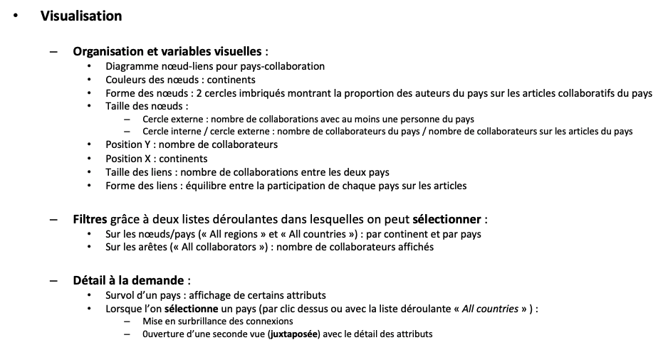
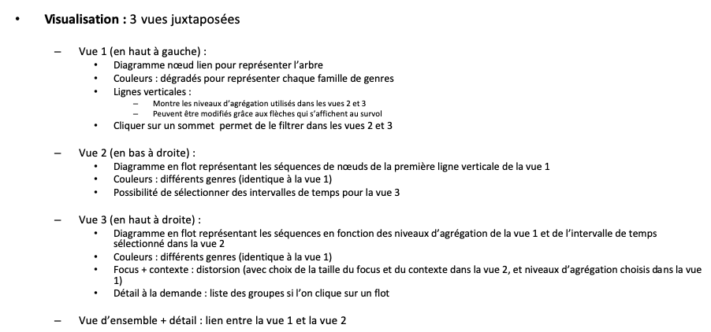

# Exercice 1

Type de donnée: 
- Largeur du sommet: Nombre de collaboration (Pays de),
- Largeur de l'arrete: Pourcentage de collaboration avec le pays en question, 

    (32')

Visu : 
- Diagramme de noeud-lien pour pays collab,
- Couleurs (Teintes !) des noeuds 
- Longueur de l'arrete: Plus l'arrete est grande pour un pays plus il y a de collaborateur du pays concerner
 

# Exercice 2:

Data :  
- Arbres des genre musicaux,
- Attribut des noeuds:
    - Initial: liste des groupes par année,
    - Dérivée: nombre de groupe par année,

# Exercice 3:
 Creation des box plot pour chaque années.

# Exercice 4:

Data :
- Ordinale: Date 
- Nominale: Lieu
- Catégoriel: Maladie
- Catégoriel: Symptome
- Catégoriel: IsOffical
- Nominale: Symptome

Structure: => Diagramme en flow avec une division par maladie selon un avec temporelle x. 
- Largeur de l'arrete en fonction du nombre
- Teinte en fonction de la maladie
- Grain en fonction de l'officialité
- Sous longueur en fonction des symptomes différent + tronc commun