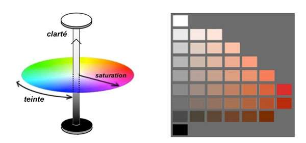

En vizu, on a trois type de réssource à prendre en considération: Ordinateur (calcul), humain (perception), écran (taille).
Avec le cour annexe nous pouvons voir les faiblesses humaines lors de la vu d'un graphique. 

Pour apprendre le d3 en profondeur => [lien](https://www.d3indepth.com/)
Documentation officiel de D3 : [lien](https://d3-wiki.readthedocs.io/)

## Trois type de question sont à prendre en considération avec la visualisation: 

### What (Donnée) ? Qu'elles sont les données à visualisé ?

- Sémantique: Ce que les donnée representent dans le vrai monde.
- Type: Interprésation (structurelle, math) => (attribut catégoriel, non quantitatif)

On a différente structure de donnée: 

- Table (e.g. DF),
- Arbre (noeud + liaison parent/enfant), 
- Champs (mesure sur un espace continu e.g. température sur le globe), 
- Géométrie (Plusieur dimension).

Attribut/variable: C'est une propriété observée, calculé ou enregistré
Type (selon le cour): 
- Donnée catégorielle
- Donnée ordonnée
    - Ordinale (Niveau 1, 2, 3), 
    - Quantitative (Appréciation sur l'intervalle R de 0 à 1).

Différent type d'ordre: 
- Séquentiel (de 0 à 1), 
- Divergent (de -1 à 1)
- Cyclique (répétition dans le temps de valeur: time série)

### Why (Tache) ? Pourquoi les utilisateurs ont besoin de visualiser ?

Comprendre le besoin => transformer en tache abstraite.
Exemple: Besoin d'aller de A à B => Trouver le plus court chemin entre A et B.

C'est permmettre une action de façon automatique : 
- Analyser, 
- Rechercher, 
- Requete
Dont la cible est: 
- Toutes les données, un attribut, un réseau, des données spatiale (notre quoi en gros)

### Comment (idiomes) ? Comment les visualisés ?

#### Encoder:

Déjà il y a une hiérarchie entre les variables visuelles selon deux types: 

- Mode magnitude (attributs ordonnés)
- Mode identité (attributs catégoriels)

Organisation spatiales:
- Tables (Exemple de 54 à 72):
    - 1D/2D, ..., nD (Max 8 sinon incomprehénsible) : 
        - item == Forme(
            - rectangle, 
            - rond, 
            - ligne,
            - plage (coloré),
            - pixel
        - Attribut catégorielles/quantitatif/ordinale == Mesurable/différentiable :
            - Teinte, 
            - longeur, 
            - hauteur,
            - position x/y/z, 
            - aire
        - Type de figure: Radar (diag Kiviat), camember, en portion, en baton, disposition en axes, coordonnée parallèle, carte de chaleur, nuage de point, flot, ligne empilé, ligne, baton empilés.
    - Arbre:
        - Type de figure: Node, Matrice, Tree Map

#### Point révision, définition: 
- Implantation dimension d'espace (donc pas la couleur): [Antisèche](http://margaux.ipt.univ-paris8.fr/vgodard/enseigne/carto2/memocart/mem12car.htm):
    - Ponctuelle: Zéro dimension spatiale 
    - Linéaire: Une dimension spatiale 
    - Zonale: Deux dimension spatiale
    - Volume: Trois dimension spatiale
- Idiome (C'est tous le processus du rendu visuel de l'information) : a specific sequence of data enrichment and enhancement transformations, visualization mappings and rendering transformations that produce an abstract display of a scientific data set [lien](http://www6.uniovi.es/hypvis/concepts/overview.htm)

**Warning:** On ne dit pas couleur mais teinte (autre couleur), luminosité (de blanc à noir), saturation (de blanc à couleur)!

Dans une visualisation on a plusieur vue (graphique), on distingue les visulations si les données ne sont pas relier, et ne partages pas le meme "contexte".  

### Coding with D3 :

=> Mind Map !
#### 

### Documentation:

**Lecture annexe:** Cour visualition et illusion d'optique [lien](./CourAnnexe/visual-perception.pdf)  

**Lecture:** Tamara  Munzner.VisualizationAnalysis& Design.A K Peters VisualizationSeries, CRC Press, 2014.

